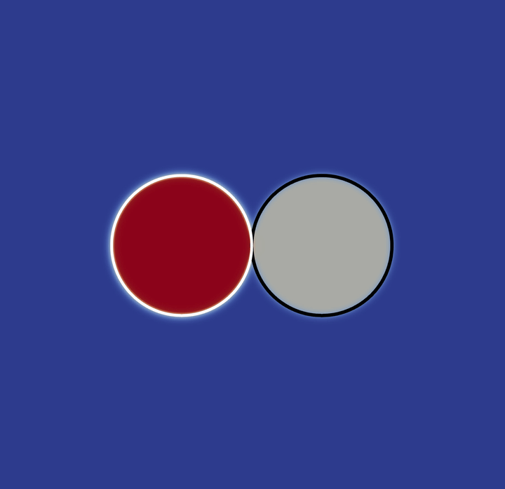

## GPU-accelerated three-component lattice Boltzmann code
CudaPhaseField is a three-phase flow solver based on the lattice Boltzmann method
taking the advantage of parallel processing via the CUDA API. The code simulates
the 2D coalescence of two immiscible droplets surrounded by the third phase. The
populations are defined in a way to preserve the device memory usage in a coalesced
manner. 	
## Simulation Result

### Requirements
The nvfortran compiler along with the cuda toolkits needs to be installed to be able to run this package. For more information regarding the nvfortran installation, we kindly refer to the following link <https://docs.nvidia.com/hpc-sdk/index.html>. Moreover, since the CUDA API is utilised, an NVIDIA GPU is required to execute the device kernels on. The output files are generated in the ascii VTK format readable by the paraview which is an open-source visualisation package found via <https://www.paraview.org/download/>.

**Note on the Makefile:** the `-gpu=` and `NVHPC_CUDA_HOME` settings in the Makefile are currently pinned to `cc61` (compute capability 6.1 / Pascal) and a CUDA 12.2 toolkit, matching the GPU this was last built and tested on. If you're running on a different GPU, adjust `-gpu=ccXY` in the Makefile to match your card's compute capability (check with `nvaccelinfo`), and update `NVHPC_CUDA_HOME` to point at a CUDA toolkit version your HPC SDK install and driver actually support.
### Build and execution
    make clean
    make
    cd bin
    ./phasefield

The Makefile supports two build modes: `release` (optimized, default) and `debug` (unoptimized, with host/device debug info and array-bounds/pointer checks enabled, for use with `cuda-gdb` or tracking down crashes). Select with:

    make BUILD=release   # default if BUILD is omitted
    make BUILD=debug

Object files are kept separately per mode (`obj/release`, `obj/debug`), so switching between them doesn't require `make clean` in between. The resulting binary is always `bin/phasefield` either way.
### Precision
The floating-point precision used throughout the solver is set in a single place: `fp_kind` in `precision_m.f90`. Toggle between the two `parameter` lines there to switch:

```fortran
!integer, parameter :: fp_kind = singlePrecision
integer, parameter :: fp_kind = doublePrecision
```

**Double precision is the default** and is recommended for any run whose results you intend to trust or report. It is slower and uses more device memory than single precision, so make sure your grid size fits comfortably within your GPU's memory.

**Single precision** runs faster and uses half the memory, but it comes at a real cost to numerical stability: over long runs it shows a gradual drift (a slow decrease in `phi3_min`, small unphysical wobble in total mass conservation) as rounding error accumulates timestep over timestep. Switch to it only for rapid prototyping and parameter sweeps where you're checking that a setup behaves sensibly, not for quantitative or publication-quality results.

### Example of use
Note that the simulation parameters in the host_var and device_var modules need to be set equally. In addition, the number of blocks as well as threads per block can be determined in the main program. An example of this can be found below:
#### main.f90
```fortran
tblock = dim3(32, 32, 1) 
grid = dim3(ceiling(real (nx+2)/tblock%x ), ceiling(real(ny+2)/tblock%y), 1)
```
#### host_var.f90
```fortran
integer,parameter :: nx = 1022
integer,parameter :: ny = 1022
real(fp_kind),parameter :: density_host(3) = [1000., 500., 1.]
integer,parameter :: exhost(0:8) = [0, 1, 0,-1, 0, 1,-1,-1, 1]
integer,parameter :: eyhost(0:8) = [0, 0, 1, 0,-1, 1, 1,-1,-1]
real(fp_kind),parameter :: wahost(0:8) = [16,4, 4, 4, 4, 1, 1, 1, 1] / 36.
real(fp_kind),parameter :: r = 150.
real(fp_kind),parameter :: densityhost(3) = [1000., 500., 1.]
real(fp_kind),parameter :: sigmahost(3,3) = reshape((/0.1, 0.1,0.1,0.1,0.1,0.1,0.1,0.1,0.1/), (/3,3/))
real(fp_kind),parameter :: landahost(3) = [(sigmahost(2,1) +  &
    sigmahost(3,1) &
    - sigmahost(3,2)) &
    , (sigmahost(2,1) + sigmahost(3,2) - sigmahost(3,1)) &
    , (sigmahost(3,1) + sigmahost(3,2) - sigmahost(2,1)) ]
real(fp_kind),parameter :: landathost = 3. / ((1. / landahost(1)) &
    + (1. / landahost(2)) + (1. / landahost(3)))
real(fp_kind),parameter :: whost = 4.
```
#### device_var.f90
```fortran
integer, constant, parameter :: nxd = 256
integer, constant, parameter ::	nyd = 256
real(fp_kind), constant, parameter :: density(3) = [1000., 500., 1.]
integer, constant, parameter :: ex(0:8) = [0, 1, 0,-1, 0, 1,-1,-1, 1]
integer, constant, parameter :: ey(0:8) = [0, 0, 1, 0,-1, 1, 1,-1,-1]
real(fp_kind), constant, parameter :: wa(0:8) = [16,4, 4, 4, 4, 1, 1, 1, 1] / 36.
real(fp_kind),parameter :: sigma(3,3) = reshape((/0.1, 0.1,0.1,0.1,0.1,0.1,0.1,0.1,0.1/), (/3,3/))
real(fp_kind), constant, parameter :: landa(3) = [(sigma(2,1) +  &
    sigma(3,1) &
    - sigma(3,2)) &
    , (sigma(2,1) + sigma(3,2) - sigma(3,1)) &
    , (sigma(3,1) + sigma(3,2) - sigma(2,1)) ]
real(fp_kind), constant, parameter :: landat = 3. / ((1. / landa(1)) &
    + (1. / landa(2)) + (1. / landa(3)))
real(fp_kind), constant,parameter :: w = 4.
```
### Citation
If you use this code in your research, please cite:

**Journal article(s):**
> Zarareh A, Khajepor S, Burnside SB, Chen B. "Improving the staircase approximation for wettability implementation of phase-field model: Part 1–Static contact angle." *Computers & Mathematics with Applications*, 98, 218-238, 2021. DOI: https://doi.org/10.1016/j.camwa.2021.07.013

> Zarareh A, Burnside SB, Khajepor S, Chen B. "Improving the staircase approximation for wettability implementation of phase-field model: Part 2–Three-component permeation." *Computers & Mathematics with Applications*, 109, 100-124, 2022. DOI: https://doi.org/10.1016/j.camwa.2022.01.005

**PhD thesis:**
> Zarareh, Amin. "Development of a pore-scale lattice Boltzmann model for interactions between multiphase fluid and solid through wetting and reactive conditions."  PhD thesis, Heriot-Watt University, 2024.

<details>
<summary>BibTeX</summary>

```bibtex
@article{zarareh2021improving,
  title={Improving the staircase approximation for wettability implementation of phase-field model: Part 1--Static contact angle},
  author={Zarareh, Amin and Khajepor, Sorush and Burnside, Stephen B and Chen, Baixin},
  journal={Computers \& Mathematics with Applications},
  volume={98},
  pages={218--238},
  year={2021},
  publisher={Elsevier}
}

@article{zarareh2022improving,
  title={Improving the staircase approximation for wettability implementation of phase-field model: Part 2--Three-component permeation},
  author={Zarareh, Amin and Burnside, Stephen B and Khajepor, Sorush and Chen, Baixin},
  journal={Computers \& Mathematics with Applications},
  volume={109},
  pages={100--124},
  year={2022},
  publisher={Elsevier}
}

@phdthesis{zarareh2024development,
  title={Development of a pore-scale lattice Boltzmann model for interactions between multiphase fluid and solid through wetting and reactive conditions},
  author={Zarareh, Amin},
  year={2024},
  school={Heriot-Watt University}
}
```

</details>