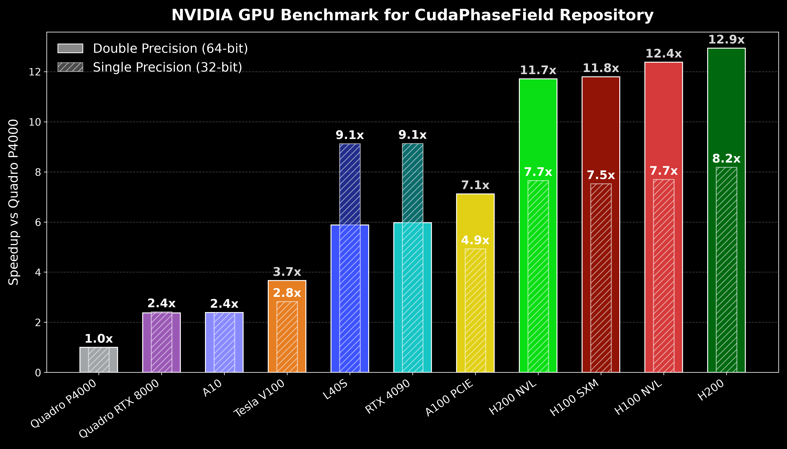

## GPU-Accelerated Three-Component Lattice Boltzmann Code
CudaPhaseField is a three-phase flow solver based on the lattice Boltzmann method
taking the advantage of parallel processing via the CUDA API. The code simulates
the coalescence of two immiscible droplets surrounded by the third phase. The
populations (distribution functions) are defined in a way to preserve the device memory usage in a coalesced
manner. 	
## Performance Benchmarks
The following benchmarks compare **single-precision (32-bit) vs. double-precision (64-bit)** execution speed across a range of NVIDIA GPUs. This is *not* a CPU vs. GPU comparison. Every data point below was measured on a GPU, running the same CUDA Fortran kernels via `nvfortran`. What is being compared is the precision mode across different hardware.

All speedups are relative to the run on a local NVIDIA Quadro P4000.

As noted in the [Precision](#precision) section below, double precision is the default and recommended mode for trustworthy results. Single precision is faster and uses less memory, but it accumulates drift over time and can lead to divergence due to accumulated truncation errors.

The GPUs benchmarked range from **data-center-grade cards to consumer-grade cards**. Consumer cards (e.g. the RTX 4090) are not designed for high native FP64 throughput. Even among data-center cards, FP64 performance should not be assumed to be high, as it varies significantly depending on the card's **FP64 TFLOPS** specification. This is a separate, and often deliberately reduced, figure from the card's FP32 TFLOPS figure. This is exactly why cards like the **L40S** show a much smaller speedup in double precision relative to single precision than you might expect from a "data-center GPU".




## Simulation Result


### Requirements
The nvfortran compiler along with the cuda toolkits needs to be installed to be able to run this package. For more information regarding the nvfortran installation, we kindly refer to the following link <https://docs.nvidia.com/hpc-sdk/index.html>. Moreover, since the CUDA API is utilised, an NVIDIA GPU is required to execute the device kernels on. The output files are generated in the ascii VTK format readable by the paraview which is an open-source visualisation package found via <https://www.paraview.org/download/>.

#### Installing nvfortran (NVIDIA HPC SDK)
The tarball install below works on any Linux x86_64 machine without needing root/admin privileges beyond the install step itself. NVIDIA doesn't provide a stable "latest" download URL, so check <https://developer.nvidia.com/hpc-sdk/downloads> for the current version number and swap it into the commands below wherever `26.5`/`2026_265` appears.

**Before running `./install`:** a GNU Fortran/gcc toolchain needs to be present and on `PATH`. If your environment is missing it (common on minimal `nvidia/cuda` container images), install it first:
```bash
sudo apt install -y build-essential gfortran
```

```bash
wget https://developer.download.nvidia.com/hpc-sdk/26.5/nvhpc_2026_265_Linux_x86_64_cuda_multi.tar.gz
tar xpzf nvhpc_2026_265_Linux_x86_64_cuda_multi.tar.gz
cd nvhpc_2026_265_Linux_x86_64_cuda_multi
./install
```
The directory `tar` extracts to matches the same version-specific naming pattern as the tarball itself.

Once installed, add the compilers to your `PATH`:
```bash
echo 'export NVHPC=/opt/nvidia/hpc_sdk' >> ~/.bashrc
echo 'export PATH=$NVHPC/Linux_x86_64/*/compilers/bin:$PATH' >> ~/.bashrc
source ~/.bashrc
nvfortran --version
```

### Build and execution
    make clean
    make
    cd bin
    ./phasefield

The Makefile supports two build modes: `release` (optimized, default) and `debug` (unoptimized, with host/device debug info and array-bounds/pointer checks enabled, for use with `cuda-gdb` or tracking down crashes). Select with:

    make BUILD=release   # default if BUILD is omitted
    make BUILD=debug

Object files are kept separately per mode (`obj/release`, `obj/debug`), so switching between them doesn't require `make clean` in between. The resulting binary is always `bin/phasefield` either way.
### Precision
The floating-point precision used throughout the solver is set in a single place: `fp_kind` in `precision_m.f90`. Toggle between the two `parameter` lines there to switch:

```fortran
!integer, parameter :: fp_kind = singlePrecision
integer, parameter :: fp_kind = doublePrecision
```

**Double precision is the default** and is recommended for any run whose results you intend to trust or report. It is slower and uses more device memory than single precision, so make sure your grid size fits comfortably within your GPU's memory.

**Single precision** runs faster and uses half the memory, but it comes at a real cost to numerical stability: over long runs it shows a gradual drift (a slow decrease in `phi3_min`, small unphysical wobble in total mass conservation) as rounding error accumulates timestep over timestep. Switch to it only for rapid prototyping and parameter sweeps where you're checking that a setup behaves sensibly, not for quantitative or publication-quality results.

### Example of use
Note that the simulation parameters in the host_var and device_var modules need to be set equally. In addition, the number of blocks as well as threads per block can be determined in the main program. An example of this can be found below:
#### main.f90
```fortran
tblock = dim3(32, 32, 1) 
grid = dim3(ceiling(real (nx+2)/tblock%x ), ceiling(real(ny+2)/tblock%y), 1)
```
#### host_var.f90
```fortran
integer,parameter :: nx = 254
integer,parameter :: ny = 254
real(fp_kind),parameter :: density_host(3) = [1000._fp_kind, 500.0_fp_kind, 100.0_fp_kind]
integer,parameter :: exhost(0:8) = [0, 1, 0,-1, 0, 1,-1,-1, 1]
integer,parameter :: eyhost(0:8) = [0, 0, 1, 0,-1, 1, 1,-1,-1]
real(fp_kind),parameter :: wahost(0:8) = [16,4, 4, 4, 4, 1, 1, 1, 1] / 36._fp_kind
real(fp_kind),parameter :: r = 35._fp_kind
real(fp_kind),parameter :: density_host(3) = [1000._fp_kind, 500.0_fp_kind, 100.0_fp_kind]
real(fp_kind),parameter :: sigmahost(3,3) = reshape((/0.1_fp_kind, 0.1_fp_kind,0.1_fp_kind,0.1_fp_kind,0.1_fp_kind,0.1_fp_kind,0.1_fp_kind,0.1_fp_kind,0.1_fp_kind/), (/3,3/))
real(fp_kind),parameter :: lambdahost(3) = [(sigmahost(2,1) +  &
    sigmahost(3,1) &
    - sigmahost(3,2)) &
    , (sigmahost(2,1) + sigmahost(3,2) - sigmahost(3,1)) &
    , (sigmahost(3,1) + sigmahost(3,2) - sigmahost(2,1)) ]
real(fp_kind),parameter :: lambdathost = 3. / ((1. / lambdahost(1)) &
    + (1. / lambdahost(2)) + (1. / lambdahost(3)))
real(fp_kind),parameter :: whost = 4._fp_kind
```
#### device_var.f90
```fortran
integer, constant, parameter :: nxd = 254
integer, constant, parameter ::	nyd = 254
real(fp_kind), constant, parameter :: density(3) = [1000._fp_kind, 500.0_fp_kind, 100.0_fp_kind]

integer, constant, parameter :: ex(0:8) = [0, 1, 0,-1, 0, 1,-1,-1, 1]
integer, constant, parameter :: ey(0:8) = [0, 0, 1, 0,-1, 1, 1,-1,-1]
real(fp_kind), constant, parameter :: wa(0:8) = [16,4, 4, 4, 4, 1, 1, 1, 1] / 36._fp_kind
real(fp_kind),parameter :: sigma(3,3) = reshape((/0.1_fp_kind, 0.1_fp_kind,0.1_fp_kind,0.1_fp_kind,0.1_fp_kind,0.1_fp_kind,0.1_fp_kind,0.1_fp_kind,0.1_fp_kind/), (/3,3/))
real(fp_kind), constant, parameter :: lambda(3) = [(sigma(2,1) +  &
    sigma(3,1) &
    - sigma(3,2)) &
    , (sigma(2,1) + sigma(3,2) - sigma(3,1)) &
    , (sigma(3,1) + sigma(3,2) - sigma(2,1)) ]
real(fp_kind), constant, parameter :: lambdat = 3._fp_kind / ((1._fp_kind / lambda(1)) &
+ (1._fp_kind / lambda(2)) + (1._fp_kind / lambda(3))) 
real(fp_kind),parameter :: tau1  = 0.9_fp_kind
real(fp_kind),parameter :: tau2  = 0.9_fp_kind
real(fp_kind),parameter :: tau3  = 0.9_fp_kind   
real(fp_kind), constant,parameter :: w = 4.
```
### Citation
If you use this code in your research, please cite:

**Journal article(s):**
> Zarareh A, Khajepor S, Burnside SB, Chen B. "Improving the staircase approximation for wettability implementation of phase-field model: Part 1–Static contact angle." *Computers & Mathematics with Applications*, 98, 218-238, 2021. DOI: https://doi.org/10.1016/j.camwa.2021.07.013

> Zarareh A, Burnside SB, Khajepor S, Chen B. "Improving the staircase approximation for wettability implementation of phase-field model: Part 2–Three-component permeation." *Computers & Mathematics with Applications*, 109, 100-124, 2022. DOI: https://doi.org/10.1016/j.camwa.2022.01.005

**PhD thesis:**
> Zarareh, Amin. "Development of a pore-scale lattice Boltzmann model for interactions between multiphase fluid and solid through wetting and reactive conditions."  PhD thesis, Heriot-Watt University, 2024.

<details>
<summary>BibTeX</summary>

```bibtex
@article{zarareh2021improving,
  title={Improving the staircase approximation for wettability implementation of phase-field model: Part 1--Static contact angle},
  author={Zarareh, Amin and Khajepor, Sorush and Burnside, Stephen B and Chen, Baixin},
  journal={Computers \& Mathematics with Applications},
  volume={98},
  pages={218--238},
  year={2021},
  publisher={Elsevier}
}

@article{zarareh2022improving,
  title={Improving the staircase approximation for wettability implementation of phase-field model: Part 2--Three-component permeation},
  author={Zarareh, Amin and Burnside, Stephen B and Khajepor, Sorush and Chen, Baixin},
  journal={Computers \& Mathematics with Applications},
  volume={109},
  pages={100--124},
  year={2022},
  publisher={Elsevier}
}

@phdthesis{zarareh2024development,
  title={Development of a pore-scale lattice Boltzmann model for interactions between multiphase fluid and solid through wetting and reactive conditions},
  author={Zarareh, Amin},
  year={2024},
  school={Heriot-Watt University}
}
```

</details>